<h1 align="center">
	Hello, I’m Ku-Tadao
</h1>

	Community Manager and Technical Support Engineer with 5 years of experience across community leadership, software localization, and hardware diagnostics.  
	Previously at <b>Swift Media Entertainment</b> (Blitz.gg), where I managed Discord bot engineering, customer support operations, localization pipelines, and social media across Blitz.gg and OsuAI. 
	Currently open to new opportunities — feel free to reach out!

<h2 align="center"></h2>

	

	

