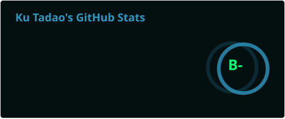
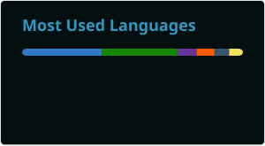

  # 👋 Hi, I'm Kubilay Karabulut

  

  

    Based in <b>Netherlands</b> &nbsp;|&nbsp; 🗣️ <b>Dutch (Native)</b>, <b>English (C2)</b>
  

  

    
    
    
  

---

### About Me

Full-stack developer and technical operations specialist with **5+ years of experience** bridging software development, community operations, workflow automation, and localization engineering.

- **Building Currently:** Co-founding and developing **GhostCheck** (Chrome Extension & platform) and **KuLink** (Smart TV media player).
- **Previously:** Spent 5 years at **Swift Media Entertainment (Blitz.gg)** building automation pipelines, managing 17-language localization workflows, shipping production code, and supporting a community of 74,000+ members.
- **Core Strengths:** React, TypeScript, Cloudflare Workers, Convex, i18n & Localization, AI-assisted workflows, and Trust & Safety engineering.

---

### Tech Stack & Skills

| Category | Skills & Tools |
| :--- | :--- |
| **Languages** | `TypeScript` `JavaScript` `Python` `C#` `HTML5` `CSS3` |
| **Frontend & Mobile** | `React` `Svelte` `Chrome Manifest V3 Extensions` `Samsung Tizen` `LG webOS` |
| **Backend & Cloud** | `Node.js` `Express.js` `Cloudflare Workers / Pages / Durable Objects` `Convex` `REST APIs` |
| **Databases & Auth** | `Clerk` `Stripe Payments` `Convex DB` |
| **DevOps & Tooling** | `Git` `GitHub Actions (CI/CD)` `Locize` `Gettext PO` `Markdown` |

 

---

### Featured Projects

<table align="center" width="100%">
  <tr>
    <td width="50%" valign="top">
      <h3 align="center">🛡️ GhostCheck</h3>
      
<i>Co-founder & Full-Stack Developer</i>

      <ul>
        <li>Moderated hiring-response reports & company reputation platform.</li>
        <li>Built with <b>React</b>, <b>TypeScript</b>, <b>Chromium Manifest V3 Extension</b>, <b>Cloudflare Workers</b>, <b>Convex</b>, and <b>Clerk</b>.</li>
        <li>Features rate-limiting, evidence validation, and automated GitHub Actions CI/CD workflows.</li>
      </ul>
    </td>
    <td width="50%" valign="top">
      <h3 align="center">📺 KuLink</h3>
      
<i>Co-founder & Technical Lead</i>

      <ul>
        <li>Privacy-conscious, pre-launch Smart TV media player designed for directional remotes.</li>
        <li>Cross-platform app targeting <b>Samsung Tizen</b> and <b>LG webOS</b> using a shared <b>TypeScript</b> codebase.</li>
        <li>Integrates <b>HLS.js</b>, <b>mpegt.js</b>, <b>QR-pairing via Cloudflare Durable Objects</b>, and <b>Stripe billing</b>.</li>
      </ul>
    </td>
  </tr>
</table>

---

### GitHub Statistics

  

    
    
  

---

  Designed with ❤️ by <a href="https://github.com/Ku-Tadao">Kubilay Karabulut</a>

